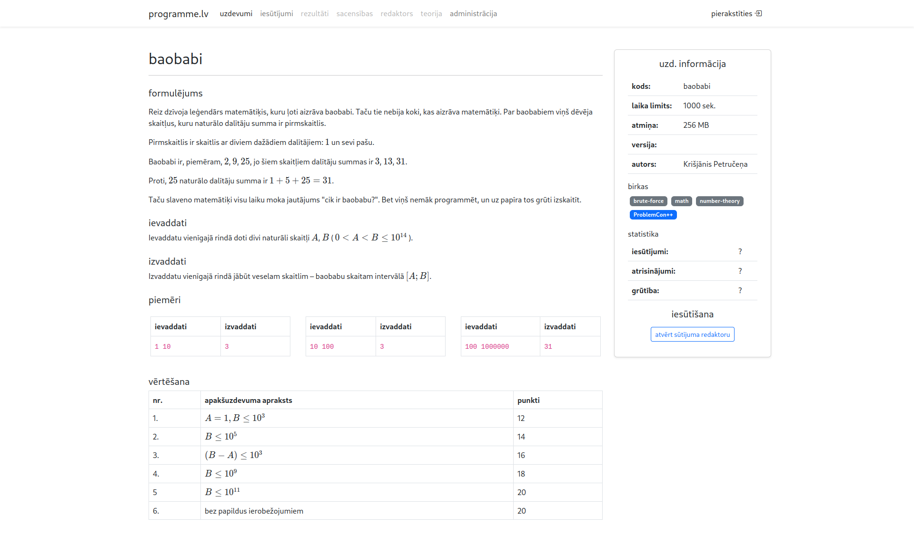

# programme.lv

Modern programming education platforma




## starting reverse proxy

```
sudo caddy run --config ./caddy.conf --adapter caddyfile
```

## starting frontend

```
cd website
yarn install
yarn run dev
```

## starting backend

```
cd backend
go run .
```